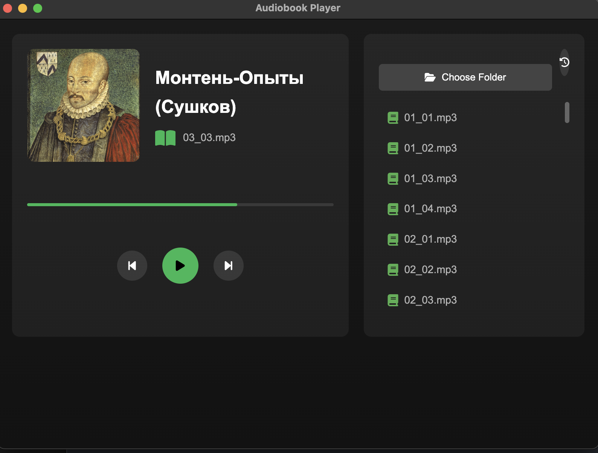

# Audiobook Player

A minimalist Electron-based audiobook player with a modern interface, crafted for a seamless and enjoyable audiobook listening experience.



## Features

- 📚 Elegant, book-focused interface
- 🎵 Remembers your last played position
- 📖 Automatic book cover display (if available)
- 📝 Listening history tracking
- ⚡ Fast and lightweight performance

## Installation

```bash
# Clone the repository
git clone https://github.com/yourusername/audiobook-player.git

# Navigate to the project directory
cd audiobook-player

# Install dependencies
npm install
```

## Usage

```bash
# Start the application in development mode
npm start
```

1. Click "Select Folder" to choose your audiobook directory.
2. The player will automatically:
* Load audio files (.mp3 supported)
* Display the book cover (if present in the folder)
* Restore your last listening position

### Building the Application
To create a standalone macOS application (.app or .dmg):

1. Ensure dependencies are installed (see Installation).
2. Run the build script:
```bash
npm run dist
```
3. Find the packaged app in the dist folder:
* dist/mac/audiobook-player.app — standalone app
* dist/audiobook-player-1.0.0.dmg — installer (optional)

## Build Requirements
* Install electron-builder:
```bash
npm install --save-dev electron-builder

### Development
Built with:

Electron - Cross-platform desktop app framework
HTML/CSS/JavaScript - Core web technologies
FontAwesome - Icons for a polished UI
Tippy.js - Lightweight tooltips

## License
MIT License - feel free to use, modify, and distribute!